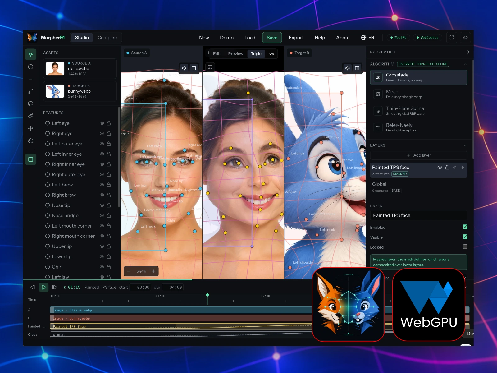

# Morpher91

A WebGPU & WebCodecs studio for 2D image and video morphing.



Place matching landmarks on two images or videos, shape the transition with layers and masks, then export the animation. Everything runs locally in your browser: no account, media upload or backend.

Created by [André Frélicot](https://andrefrelicot.dev/) · September 2026

## What you can do

- **Compare four algorithms:** crossfade, Delaunay mesh warping, thin-plate splines and Beier–Neely line fields.
- **Combine layers:** give each layer its own algorithm, timing, opacity and blend mode. Limit its effect with a region, a painted mask, or both; feather or invert the mask.
- **Match shapes:** use points, segments and polylines to pair features in Source A and Target B.
- **Animate:** mix still images and videos, set clip durations and offsets, and animate landmarks with keyframes.
- **Inspect the result:** switch between Edit, Preview and Triple views, or compare the four algorithms side by side.
- **Export:** MP4, WebM or a ZIP of PNG frames, with codec availability checked on your device.
- **Learn in the studio:** contextual step-by-step guides and 22 presets covering the main features. Presets are automatically generated demonstrations; artistic quality is not guaranteed.

The interface and guides are available in 16 languages: English, French, German, Spanish, Italian, Brazilian Portuguese, Turkish, Indonesian, Russian, Japanese, Korean, Simplified Chinese, Thai, Hindi, Bengali and Arabic. Fonts are self-hosted; Arabic uses a right-to-left interface.

## Run locally

Use Node.js 22.12+ and pnpm 11.25.0 (pinned in `app/package.json`).

```sh
git clone https://github.com/AndreFrelicot/morpher91.git
cd morpher91/app
pnpm install --frozen-lockfile
pnpm dev
```

Open the localhost URL printed by Vite. No environment variables or API keys are required. For a populated development workspace, open `/?bwmFixture=default`; this fixture route is available only in development.

## Build and deploy

```sh
cd app
pnpm build
pnpm preview
```

Publish the contents of `app/dist/` to a static host **at the origin root over HTTPS**. Subdirectory hosting such as `https://user.github.io/morpher91/` is not supported by the current asset URLs and service-worker scope. A dedicated domain works; no server-side runtime is needed.

Every `pnpm build` increments the patch version in `app/package.json` before compilation. The About box and offline cache use that version. The build creates no commit, tag or push; use `pnpm typecheck` to validate without incrementing it.

Morpher91 is a PWA with installation icons and an offline application shell. After an initial online launch and service-worker activation, it can reopen with your own files offline. Demo media still requires a connection. Full fonts for additional writing systems are cached after their first use. Save your project explicitly before closing the app.

See [PWA and deployment notes](docs/PWA.md) for update behavior and iPad checks.

## Browser and device requirements

A secure context (HTTPS or localhost) and WebGPU are required. Video export also needs WebCodecs and a supported encoder configuration; the application checks capabilities at runtime. Codec availability depends on the browser, operating system and device.

Desktop and tablet are the intended workspaces. The small-screen layout is experimental. iPad supports Apple Pencil through Pointer Events, but simultaneous palm input and the full gesture matrix still need hardware validation. Automated tests do not certify GPU output or device compatibility.

## Project files and limits

Projects use `.morph.json`. Imported still images are embedded; video bytes are not. Reopening a video project asks you to reconnect the original files while preserving edits and timing.

- No audio import or export.
- Export supports 1–15 seconds at 12–60 fps, up to 3840 × 2160 within device texture limits.
- PNG sequences support transparency; video exports flatten transparency to black.
- The initial JavaScript bundle is relatively large; language catalogues and several UI surfaces load on demand.
- Translations have automated consistency checks and editorial review, but have not all been validated by native speakers.

User media stays on the device. A static host can still receive ordinary requests for application files, fonts and demo media.

## Development

Run checks from `app/`:

```sh
pnpm format:check
pnpm typecheck
pnpm exec eslint . --max-warnings=0
pnpm test
pnpm build
```

```text
app/src/
  assist/         contextual guides and UI anchors
  features/       Studio, Compare, demo library and export UI
  i18n/           language catalogues, loading and font metadata
  lib/            browser media, geometry, viewport and GPU helpers
  morph/          algorithms, layers, project model, playback and export
  pwa/            service worker and cache policy
  store/          project, editor, history and export state
  ui/             shared controls and desktop/mobile layouts
```

Preview and export share the layered renderer and timeline resolution. Keep them in agreement when changing rendering behavior. Source code, shaders, tests, fonts, demo media and maintenance scripts are included; normal builds need neither Python nor macOS utilities.

See [CONTRIBUTING.md](CONTRIBUTING.md) for checks and localization requirements, and [demo asset notes](docs/DEMO_ASSETS.md) for provenance and regeneration.

## License

The original application code and documentation are available under the [MIT License](LICENSE), copyright © 2026 André Frélicot.

Dependencies and fonts retain their own licenses. In particular, Mediabunny uses MPL-2.0 and the bundled fonts use the SIL Open Font License. See [third-party notices](THIRD_PARTY_NOTICES.md) and [media licensing](docs/DEMO_ASSETS.md) for the scope of these terms.
